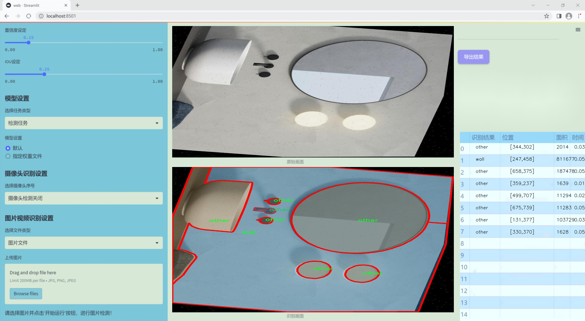
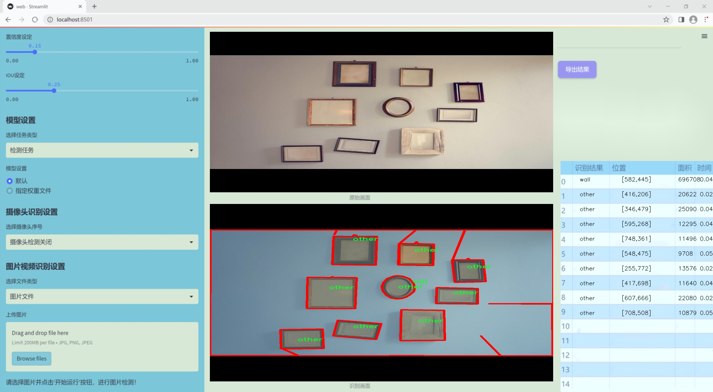
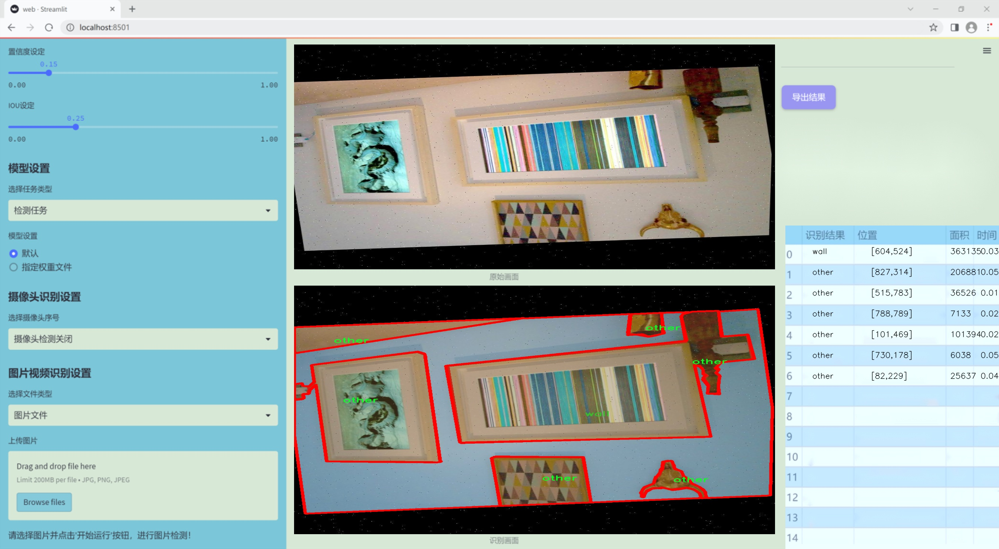
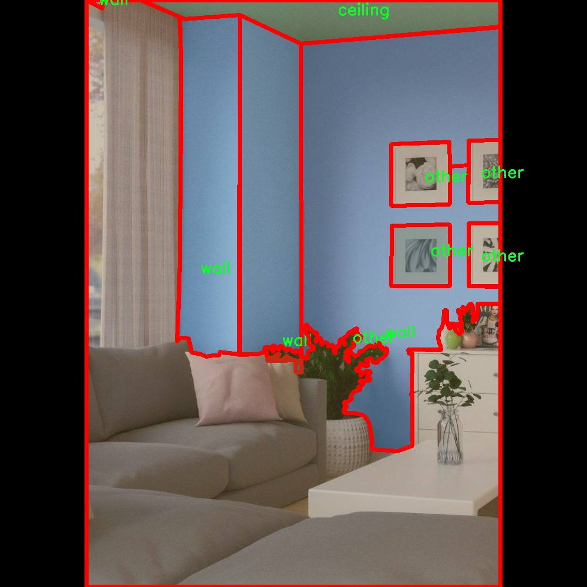
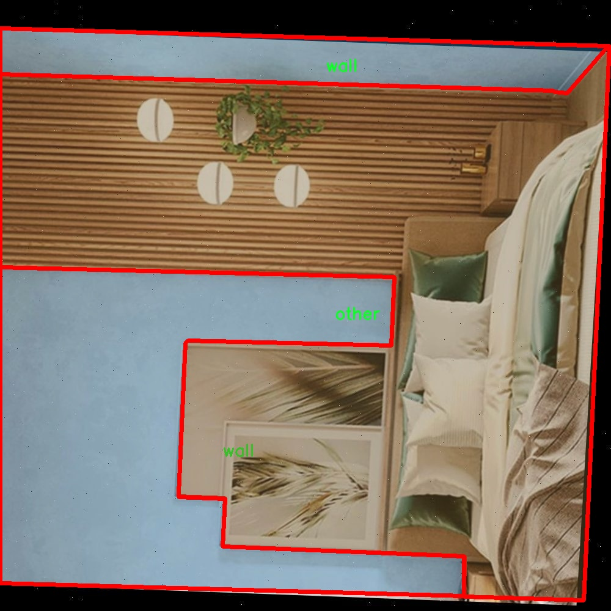
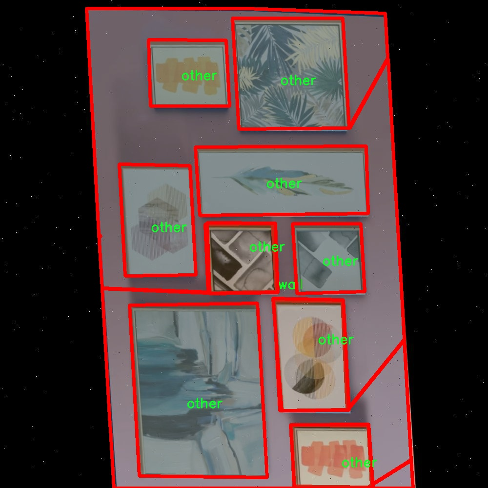
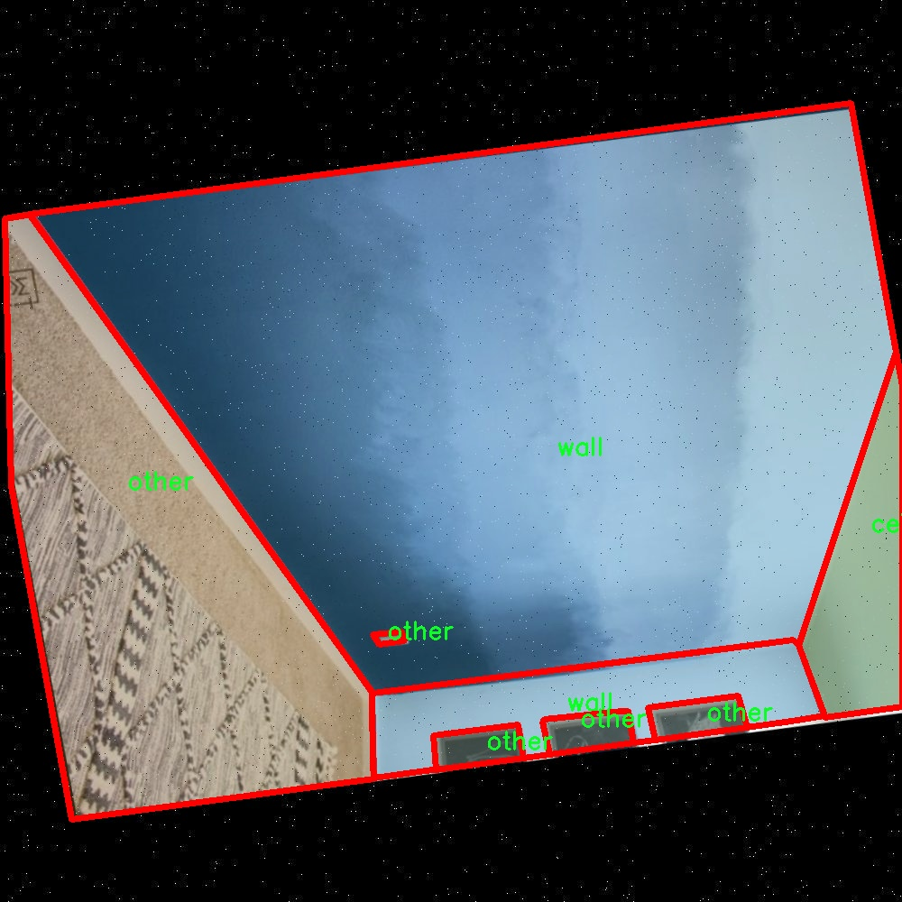
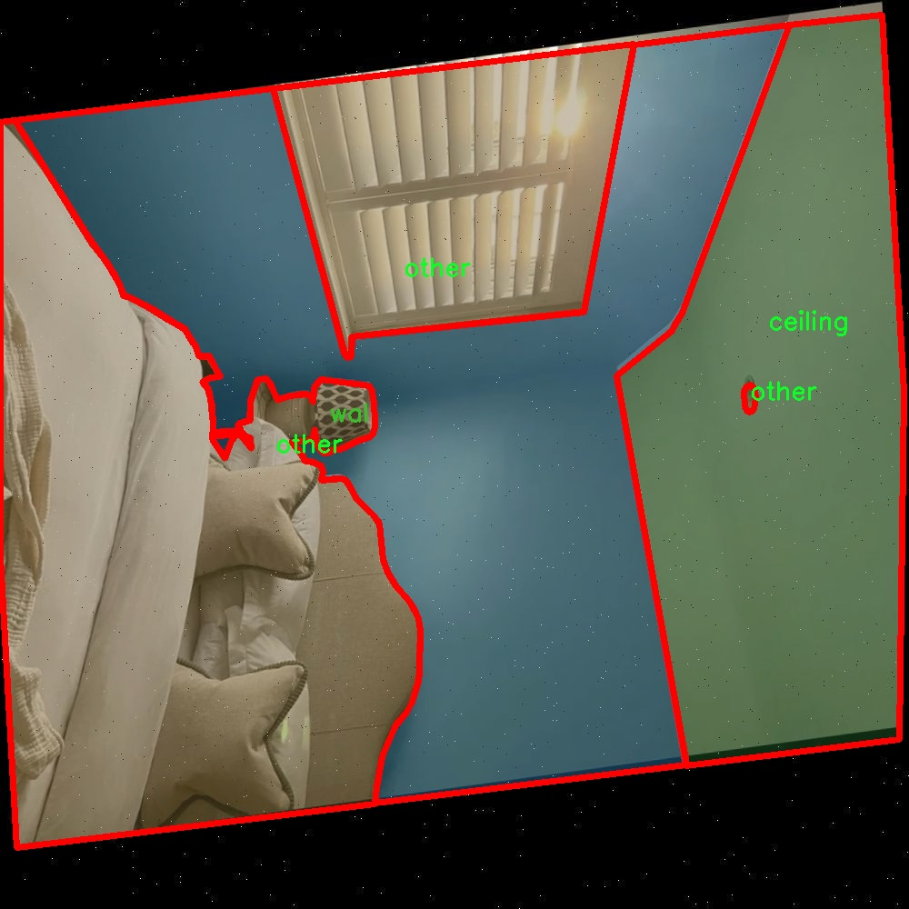

### 1.背景意义

研究背景与意义

随着智能家居和自动化技术的快速发展，室内场景理解在计算机视觉领域中变得愈发重要。室内场景分割不仅是计算机视觉的基础任务之一，也是实现智能家居、机器人导航、增强现实等应用的关键技术。传统的图像分割方法在处理复杂的室内环境时往往面临诸多挑战，如光照变化、物体遮挡和背景复杂性等。因此，开发一种高效且准确的室内场景分割系统显得尤为重要。

YOLO（You Only Look Once）系列模型因其快速和高效的特性，已成为目标检测和分割领域的热门选择。YOLOv11作为该系列的最新版本，进一步提升了模型的准确性和实时性。然而，针对室内场景的特定需求，YOLOv11的标准配置可能并不足以满足所有应用场景的要求。因此，改进YOLOv11以适应室内场景分割，尤其是在对天花板、墙壁等特定类别进行精准识别和分割，将为智能家居系统的实现提供强有力的支持。

本研究基于ADE20K数据集，该数据集包含2500幅经过精确标注的室内场景图像，涵盖了天花板、墙壁等关键类别。通过对这些图像进行深度学习训练，模型能够有效学习到室内环境的特征，从而实现高效的场景分割。研究的意义在于，不仅为室内场景分割提供了一种新的技术方案，也为相关领域的研究提供了数据支持和理论基础。通过改进YOLOv11模型，期望能够提升室内场景分割的准确性和实时性，为未来的智能家居、机器人导航等应用奠定坚实的基础。

### 2.视频效果

[2.1 视频效果](https://www.bilibili.com/video/BV1LdqVYYEhi/)

### 3.图片效果







##### [项目涉及的源码数据来源链接](https://kdocs.cn/l/cszuIiCKVNis)**

注意：本项目提供训练的数据集和训练教程,由于版本持续更新,暂不提供权重文件（best.pt）,请按照6.训练教程进行训练后实现上图演示的效果。

### 4.数据集信息

##### 4.1 本项目数据集类别数＆类别名

nc: 3
names: ['ceiling', 'other', 'wall']


该项目为【图像分割】数据集，请在【训练教程和Web端加载模型教程（第三步）】这一步的时候按照【图像分割】部分的教程来训练

##### 4.2 本项目数据集信息介绍

本项目数据集信息介绍

本项目所使用的数据集为“ade20k-dataset-v4.0.1”，该数据集专注于室内场景的分割任务，旨在为改进YOLOv11的室内场景分割系统提供丰富的训练素材。该数据集包含三种主要类别，分别是“ceiling”（天花板）、“other”（其他）和“wall”（墙壁），共计三个类别。这些类别的选择反映了室内环境中常见的结构元素，为模型的训练提供了必要的多样性和代表性。

在数据集的构建过程中，研究团队对每一类进行了精细的标注，以确保在训练过程中，模型能够准确识别和分割出不同的室内元素。天花板作为室内空间的重要组成部分，其形状、颜色和材质的多样性为模型的学习提供了丰富的特征信息。墙壁则是室内环境的基础构件，其位置和设计风格直接影响空间的视觉效果和功能性。而“其他”类别则涵盖了各种可能出现的室内物体和结构，确保模型在面对复杂场景时能够具备更强的适应能力。

通过对这些类别的深度学习，改进后的YOLOv11模型将能够在多种室内环境中实现更高效的分割，提升其在实际应用中的表现。这一数据集不仅为模型提供了必要的训练基础，也为后续的测试和验证提供了可靠的数据支持。随着对室内场景理解的不断深入，模型的分割精度和实时性将得到显著提升，为智能家居、室内导航等应用场景的实现奠定坚实的基础。











### 5.全套项目环境部署视频教程（零基础手把手教学）

[5.1 所需软件PyCharm和Anaconda安装教程（第一步）](https://www.bilibili.com/video/BV1BoC1YCEKi/?spm_id_from=333.999.0.0&vd_source=bc9aec86d164b67a7004b996143742dc)


[5.2 安装Python虚拟环境创建和依赖库安装视频教程（第二步）](https://www.bilibili.com/video/BV1ZoC1YCEBw?spm_id_from=333.788.videopod.sections&vd_source=bc9aec86d164b67a7004b996143742dc)

### 6.改进YOLOv11训练教程和Web_UI前端加载模型教程（零基础手把手教学）

[6.1 改进YOLOv11训练教程和Web_UI前端加载模型教程（第三步）](https://www.bilibili.com/video/BV1BoC1YCEhR?spm_id_from=333.788.videopod.sections&vd_source=bc9aec86d164b67a7004b996143742dc)


按照上面的训练视频教程链接加载项目提供的数据集，运行train.py即可开始训练



     Epoch   gpu_mem       box       obj       cls    labels  img_size
     1/200     20.8G   0.01576   0.01955  0.007536        22      1280: 100%|██████████| 849/849 [14:42<00:00,  1.04s/it]
               Class     Images     Labels          P          R     mAP@.5 mAP@.5:.95: 100%|██████████| 213/213 [01:14<00:00,  2.87it/s]
                 all       3395      17314      0.994      0.957      0.0957      0.0843

     Epoch   gpu_mem       box       obj       cls    labels  img_size
     2/200     20.8G   0.01578   0.01923  0.007006        22      1280: 100%|██████████| 849/849 [14:44<00:00,  1.04s/it]
               Class     Images     Labels          P          R     mAP@.5 mAP@.5:.95: 100%|██████████| 213/213 [01:12<00:00,  2.95it/s]
                 all       3395      17314      0.996      0.956      0.0957      0.0845

     Epoch   gpu_mem       box       obj       cls    labels  img_size
     3/200     20.8G   0.01561    0.0191  0.006895        27      1280: 100%|██████████| 849/849 [10:56<00:00,  1.29it/s]
               Class     Images     Labels          P          R     mAP@.5 mAP@.5:.95: 100%|███████   | 187/213 [00:52<00:00,  4.04it/s]
                 all       3395      17314      0.996      0.957      0.0957      0.0845


###### [项目数据集下载链接](https://kdocs.cn/l/cszuIiCKVNis)

### 7.原始YOLOv11算法讲解

YOLO11采用改进的骨干和颈部架构，增强了特征提取能力，提高了物体检测的精确度和复杂任务的表现。YOLO11引入精炼的架构设计和优化的训练流程，实现更快的处理速度，同时保持精度和性能之间的最佳平衡。通过模型设计的进步，YOLO11m在COCO数据集上实现了更高的均值平均精度（mAP），同时使用比YOLOv8m少22%的参数，使其在不妥协准确性的情况下更加计算高效。YOLO11可以无缝部署在各种环境中，包括边缘设备、云平台以及支持NVIDIA
GPU的系统，确保最大灵活性。无论是物体检测、实例分割、图像分类、姿态估计，还是定向物体检测（OBB），YOLO11都旨在应对多样的计算机视觉挑战。


##### **Ultralytics YOLO11相比于之前版本的主要改进有哪些？**

Ultralytics YOLO11在其前身基础上引入了几项重要进步。主要改进包括：

  1. **增强的特征提取** ：YOLO11采用改进的骨干和颈部架构，增强了特征提取能力，提高了物体检测的精确度。
  2.  **优化的效率和速度** ：精炼的架构设计和优化的训练流程实现了更快的处理速度，同时保持了准确性和性能之间的平衡。
  3.  **更高的准确性与更少的参数** ：YOLO11m在COCO数据集上实现了更高的均值平均精度（mAP），同时使用比YOLOv8m少22%的参数，使其在不妥协准确性的情况下更加计算高效。
  4.  **环境适应性强** ：YOLO11可以在多种环境中部署，包括边缘设备、云平台以及支持NVIDIA GPU的系统。
  5.  **支持广泛的任务** ：YOLO11支持多种计算机视觉任务，如物体检测、实例分割、图像分类、姿态估计和定向物体检测（OBB）。

我们先来看一下其网络结构有什么变化，可以看出，相比较于YOLOv8模型，其将CF2模块改成C3K2，同时在SPPF模块后面添加了一个C2PSA模块，且将YOLOv10的head思想引入到YOLO11的head中，使用深度可分离的方法，减少冗余计算，提高效率。下面我们来详细看一下这两个模块的结构是怎么构成的，以及它们为什么要这样设计


##### C3K2的网络结构

从下面图中我们可以看到，C3K2模块其实就是C2F模块转变出来的，它代码中有一个设置，就是当c3k这个参数为FALSE的时候，C3K2模块就是C2F模块，也就是说它的Bottleneck是普通的Bottleneck；反之当它为true的时候，将Bottleneck模块替换成C3模块。


##### C2PSA的网络结构

` `C2PSA是对 `C2f` 模块的扩展，它结合了PSA(Pointwise Spatial
Attention)块，用于增强特征提取和注意力机制。通过在标准 `C2f` 模块中引入 PSA
块，C2PSA实现了更强大的注意力机制，从而提高了模型对重要特征的捕捉能力。


##### **C2f 模块回顾：**

**** C2f模块是一个更快的 CSP（Cross Stage Partial）瓶颈实现，它通过两个卷积层和多个 Bottleneck
块进行特征提取。相比传统的 CSPNet，C2f 优化了瓶颈层的结构，使得计算速度更快。在 C2f中，`cv1` 是第一个 1x1
卷积，用于减少通道数；`cv2` 是另一个 1x1 卷积，用于恢复输出通道数。而 `n` 是一个包含 Bottleneck 块的数量，用于提取特征。

##### **C2PSA 模块的增强** ：

**C2PSA** 扩展了 C2f，通过引入PSA( **Position-Sensitive Attention)**
，旨在通过多头注意力机制和前馈神经网络来增强特征提取能力。它可以选择性地添加残差结构（shortcut）以优化梯度传播和网络训练效果。同时，使用FFN
可以将输入特征映射到更高维的空间，捕获输入特征的复杂非线性关系，允许模型学习更丰富的特征表示。

##### head部分

YOLO11在head部分的cls分支上使用深度可分离卷积 ，具体代码如下，cv2边界框回归分支，cv3分类分支。

    
    
     self.cv2 = nn.ModuleList(
                nn.Sequential(Conv(x, c2, 3), Conv(c2, c2, 3), nn.Conv2d(c2, 4 * self.reg_max, 1)) for x in ch
            )
            self.cv3 = nn.ModuleList(
                nn.Sequential(
                    nn.Sequential(DWConv(x, x, 3), Conv(x, c3, 1)),
                    nn.Sequential(DWConv(c3, c3, 3), Conv(c3, c3, 1)),
                    nn.Conv2d(c3, self.nc, 1),
                )
                for x in ch
            )


### 8.200+种全套改进YOLOV11创新点原理讲解

#### 8.1 200+种全套改进YOLOV11创新点原理讲解大全

由于篇幅限制，每个创新点的具体原理讲解就不全部展开，具体见下列网址中的改进模块对应项目的技术原理博客网址【Blog】（创新点均为模块化搭建，原理适配YOLOv5~YOLOv11等各种版本）

[改进模块技术原理博客【Blog】网址链接](https://gitee.com/qunmasj/good)


#### 8.2 精选部分改进YOLOV11创新点原理讲解

###### 这里节选部分改进创新点展开原理讲解(完整的改进原理见上图和[改进模块技术原理博客链接](https://gitee.com/qunmasj/good)【如果此小节的图加载失败可以通过CSDN或者Github搜索该博客的标题访问原始博客，原始博客图片显示正常】

### 动态蛇形卷积Dynamic Snake Convolution

参考论文： 2307.08388.pdf (arxiv.org)

血管、道路等拓扑管状结构的精确分割在各个领域都至关重要，确保下游任务的准确性和效率。 然而，许多因素使任务变得复杂，包括薄的局部结构和可变的全局形态。在这项工作中，我们注意到管状结构的特殊性，并利用这些知识来指导我们的 DSCNet 在三个阶段同时增强感知：特征提取、特征融合、 和损失约束。 首先，我们提出了一种动态蛇卷积，通过自适应地关注细长和曲折的局部结构来准确捕获管状结构的特征。 随后，我们提出了一种多视图特征融合策略，以补充特征融合过程中多角度对特征的关注，确保保留来自不同全局形态的重要信息。 最后，提出了一种基于持久同源性的连续性约束损失函数，以更好地约束分割的拓扑连续性。 2D 和 3D 数据集上的实验表明，与多种方法相比，我们的 DSCNet 在管状结构分割任务上提供了更好的准确性和连续性。 我们的代码是公开的。 
主要的挑战源于细长微弱的局部结构特征与复杂多变的全局形态特征。本文关注到管状结构细长连续的特点，并利用这一信息在神经网络以下三个阶段同时增强感知：特征提取、特征融合和损失约束。分别设计了动态蛇形卷积（Dynamic Snake Convolution），多视角特征融合策略与连续性拓扑约束损失。 

我们希望卷积核一方面能够自由地贴合结构学习特征，另一方面能够在约束条件下不偏离目标结构太远。在观察管状结构的细长连续的特征后，脑海里想到了一个动物——蛇。我们希望卷积核能够像蛇一样动态地扭动，来贴合目标的结构。

我们希望卷积核一方面能够自由地贴合结构学习特征，另一方面能够在约束条件下不偏离目标结构太远。在观察管状结构的细长连续的特征后，脑海里想到了一个动物——蛇。我们希望卷积核能够像蛇一样动态地扭动，来贴合目标的结构。


### DCNV2融入YOLOv11
DCN和DCNv2（可变性卷积）
网上关于两篇文章的详细描述已经很多了，我这里具体的细节就不多讲了，只说一下其中实现起来比较困惑的点。（黑体字会讲解）

DCNv1解决的问题就是我们常规的图像增强，仿射变换（线性变换加平移）不能解决的多种形式目标变换的几何变换的问题。如下图所示。

可变性卷积的思想很简单，就是讲原来固定形状的卷积核变成可变的。如下图所示：


首先来看普通卷积，以3x3卷积为例对于每个输出y(p0)，都要从x上采样9个位置，这9个位置都在中心位置x(p0)向四周扩散得到的gird形状上，(-1,-1)代表x(p0)的左上角，(1,1)代表x(p0)的右下角，其他类似。

用公式表示如下：


可变性卷积Deformable Conv操作并没有改变卷积的计算操作，而是在卷积操作的作用区域上，加入了一个可学习的参数∆pn。同样对于每个输出y(p0)，都要从x上采样9个位置，这9个位置是中心位置x(p0)向四周扩散得到的，但是多了 ∆pn，允许采样点扩散成非gird形状。


偏移量是通过对原始特征层进行卷积得到的。比如输入特征层是w×h×c，先对输入的特征层进行卷积操作，得到w×h×2c的offset field。这里的w和h和原始特征层的w和h是一致的，offset field里面的值是输入特征层对应位置的偏移量，偏移量有x和y两个方向，所以offset field的channel数是2c。offset field里的偏移量是卷积得到的，可能是浮点数，所以接下来需要通过双向性插值计算偏移位置的特征值。在偏移量的学习中，梯度是通过双线性插值来进行反向传播的。
看到这里是不是还是有点迷茫呢？那到底程序上面怎么实现呢？


事实上由上面的公式我们可以看得出来∆pn这个偏移量是加在原像素点上的，但是我们怎么样从代码上对原像素点加这个量呢？其实很简单，就是用一个普通的卷积核去跟输入图片（一般是输入的feature_map）卷积就可以了卷积核的数量是2N也就是23*3==18（前9个通道是x方向的偏移量，后9个是y方向的偏移量），然后把这个卷积的结果与正常卷积的结果进行相加就可以了。
然后又有了第二个问题，怎么样反向传播呢？为什么会有这个问题呢？因为求出来的偏移量+正常卷积输出的结果往往是一个浮点数，浮点数是无法对应到原图的像素点的，所以自然就想到了双线性差值的方法求出浮点数对应的浮点像素点。


#### DCN v2
对于positive的样本来说，采样的特征应该focus在RoI内，如果特征中包含了过多超出RoI的内容，那么结果会受到影响和干扰。而negative样本则恰恰相反，引入一些超出RoI的特征有助于帮助网络判别这个区域是背景区域。

DCNv1引入了可变形卷积，能更好的适应目标的几何变换。但是v1可视化结果显示其感受野对应位置超出了目标范围，导致特征不受图像内容影响（理想情况是所有的对应位置分布在目标范围以内）。

为了解决该问题：提出v2, 主要有

1、扩展可变形卷积，增强建模能力
2、提出了特征模拟方案指导网络培训：feature mimicking scheme

上面这段话是什么意思呢，通俗来讲就是，我们的可变性卷积的区域大于目标所在区域，所以这时候就会对非目标区域进行错误识别。

所以自然能想到的解决方案就是加入权重项进行惩罚。（至于这个实现起来就比较简单了，直接初始化一个权重然后乘(input+offsets)就可以了）


可调节的RoIpooling也是类似的，公式如下：


### 9.系统功能展示

图9.1.系统支持检测结果表格显示

  图9.2.系统支持置信度和IOU阈值手动调节

  图9.3.系统支持自定义加载权重文件best.pt(需要你通过步骤5中训练获得)

  图9.4.系统支持摄像头实时识别

  图9.5.系统支持图片识别

  图9.6.系统支持视频识别

  图9.7.系统支持识别结果文件自动保存

  图9.8.系统支持Excel导出检测结果数据


### 10. YOLOv11核心改进源码讲解

#### 10.1 test_selective_scan_speed.py

以下是对代码的核心部分进行分析和注释的结果：

```python
import torch
import torch.nn.functional as F
from einops import rearrange

def build_selective_scan_fn(selective_scan_cuda: object = None, mode="mamba_ssm", tag=None):
    """
    构建选择性扫描函数，返回一个自定义的 PyTorch 函数。
    
    参数:
    selective_scan_cuda: 自定义 CUDA 扩展，用于实现选择性扫描的前向和反向传播。
    mode: 选择的模式，影响选择性扫描的实现方式。
    tag: 用于标识该函数的标签。
    """
    
    class SelectiveScanFn(torch.autograd.Function):
        @staticmethod
        def forward(ctx, u, delta, A, B, C, D=None, z=None, delta_bias=None, delta_softplus=False, return_last_state=False, nrows=1, backnrows=-1):
            """
            前向传播函数，执行选择性扫描的计算。
            
            参数:
            ctx: 上下文对象，用于保存信息以供反向传播使用。
            u, delta, A, B, C, D, z: 输入张量，具体含义根据上下文而定。
            delta_bias: 偏置项。
            delta_softplus: 是否对 delta 应用 softplus 激活函数。
            return_last_state: 是否返回最后的状态。
            nrows, backnrows: 控制扫描的行数。
            
            返回:
            out: 选择性扫描的输出。
            last_state: 最后状态（可选）。
            """
            # 确保输入张量是连续的
            if u.stride(-1) != 1:
                u = u.contiguous()
            if delta.stride(-1) != 1:
                delta = delta.contiguous()
            if D is not None:
                D = D.contiguous()
            if B.stride(-1) != 1:
                B = B.contiguous()
            if C.stride(-1) != 1:
                C = C.contiguous()
            if z is not None and z.stride(-1) != 1:
                z = z.contiguous()

            # 处理输入张量的维度
            if B.dim() == 3:
                B = rearrange(B, "b dstate l -> b 1 dstate l")
                ctx.squeeze_B = True
            if C.dim() == 3:
                C = rearrange(C, "b dstate l -> b 1 dstate l")
                ctx.squeeze_C = True

            # 确保数据类型为 float
            if D is not None and (D.dtype != torch.float):
                ctx._d_dtype = D.dtype
                D = D.float()
            if delta_bias is not None and (delta_bias.dtype != torch.float):
                ctx._delta_bias_dtype = delta_bias.dtype
                delta_bias = delta_bias.float()

            # 确保输入的形状符合要求
            assert u.shape[1] % (B.shape[1] * nrows) == 0 
            assert nrows in [1, 2, 3, 4] 

            if backnrows > 0:
                assert u.shape[1] % (B.shape[1] * backnrows) == 0 
                assert backnrows in [1, 2, 3, 4] 
            else:
                backnrows = nrows
            ctx.backnrows = backnrows
            
            # 调用 CUDA 扩展进行前向计算
            if mode in ["mamba_ssm"]:
                out, x, *rest = selective_scan_cuda.fwd(u, delta, A, B, C, D, z, delta_bias, delta_softplus)
            else:
                raise NotImplementedError

            ctx.delta_softplus = delta_softplus
            ctx.has_z = z is not None

            last_state = x[:, :, -1, 1::2]  # 获取最后状态
            ctx.save_for_backward(u, delta, A, B, C, D, delta_bias, x)
            return out if not return_last_state else (out, last_state)

        @staticmethod
        def backward(ctx, dout):
            """
            反向传播函数，计算梯度。
            
            参数:
            ctx: 上下文对象，包含前向传播时保存的信息。
            dout: 来自后续层的梯度。
            
            返回:
            各输入的梯度。
            """
            u, delta, A, B, C, D, delta_bias, x = ctx.saved_tensors
            
            if dout.stride(-1) != 1:
                dout = dout.contiguous()

            # 调用 CUDA 扩展进行反向计算
            du, ddelta, dA, dB, dC, dD, ddelta_bias, *rest = selective_scan_cuda.bwd(
                u, delta, A, B, C, D, delta_bias, dout, x, ctx.delta_softplus, ctx.backnrows
            )

            return (du, ddelta, dA, dB, dC, dD if D is not None else None, ddelta_bias if delta_bias is not None else None)

    def selective_scan_fn(u, delta, A, B, C, D=None, z=None, delta_bias=None, delta_softplus=False, return_last_state=False, nrows=1, backnrows=-1):
        """
        封装选择性扫描函数，便于调用。
        """
        return SelectiveScanFn.apply(u, delta, A, B, C, D, z, delta_bias, delta_softplus, return_last_state, nrows, backnrows)

    return selective_scan_fn
```

### 代码核心部分说明：
1. **`build_selective_scan_fn`**: 这个函数构建了一个选择性扫描的自定义函数，使用 PyTorch 的 `torch.autograd.Function` 类。它允许我们定义前向和反向传播的计算。

2. **`SelectiveScanFn` 类**: 这是一个内部类，定义了前向和反向传播的具体实现。
   - **`forward` 方法**: 处理输入数据，调用 CUDA 扩展进行前向计算，并返回输出和最后状态（如果需要）。
   - **`backward` 方法**: 计算梯度，调用 CUDA 扩展进行反向计算。

3. **输入数据的处理**: 在前向传播中，确保输入张量是连续的，并根据需要调整维度和数据类型。

4. **CUDA 扩展的调用**: 通过 `selective_scan_cuda.fwd` 和 `selective_scan_cuda.bwd` 来实现高效的前向和反向计算。

5. **返回值**: 根据 `return_last_state` 参数，返回最终的输出和最后的状态。

这个代码片段是实现选择性扫描的核心，主要用于高效的序列数据处理，特别是在深度学习模型中。

这个文件 `test_selective_scan_speed.py` 主要用于测试和评估选择性扫描（Selective Scan）算法的速度和性能。该文件包含了多个函数和类的定义，利用 PyTorch 框架进行张量运算，并且结合了 CUDA 加速。

首先，文件中定义了一个 `build_selective_scan_fn` 函数，它接受一个 CUDA 实现的选择性扫描函数和其他参数，返回一个自定义的 PyTorch 自动求导函数 `SelectiveScanFn`。这个类实现了前向传播和反向传播的逻辑。前向传播中，首先对输入张量进行一些处理，确保它们是连续的，并根据输入的维度进行调整。接着，根据不同的模式（如 "mamba_ssm"、"sscore" 等）调用相应的 CUDA 函数进行计算，最后保存必要的上下文信息以供反向传播使用。

在 `SelectiveScanFn` 的 `backward` 方法中，使用保存的张量和传入的梯度信息计算各个输入的梯度。这部分逻辑也会根据不同的模式进行处理，确保梯度计算的正确性。

接下来，文件中定义了几个选择性扫描的参考实现函数，如 `selective_scan_ref`、`selective_scan_easy` 和 `selective_scan_easy_v2`。这些函数实现了选择性扫描的基本逻辑，利用张量的逐步计算来生成输出。它们接受一系列输入参数，包括状态张量、时间增量、权重矩阵等，并通过循环计算得到最终的输出。

文件的最后部分是 `test_speed` 函数，它用于测试不同选择性扫描实现的速度。该函数设置了一些参数，如数据类型、批次大小、序列长度等，并生成随机输入数据。然后，它使用 `partial` 函数创建多个测试用例，并在循环中多次调用这些测试函数以测量它们的执行时间。测试结果将显示每个实现的前向和反向传播所需的时间。

总的来说，这个文件是一个性能测试工具，旨在比较不同选择性扫描实现的效率，并通过 CUDA 加速来提高计算性能。通过对比不同模式和实现，开发者可以找到最佳的选择性扫描方法，以满足特定的应用需求。

#### 10.2 pkinet.py

以下是经过简化和注释的核心代码部分，保留了主要的类和函数，并添加了详细的中文注释：

```python
import math
import torch
import torch.nn as nn
from typing import Optional, Sequence

# 定义一个函数，用于随机丢弃路径（随机深度）
def drop_path(x: torch.Tensor, drop_prob: float = 0., training: bool = False) -> torch.Tensor:
    """根据给定的丢弃概率随机丢弃路径"""
    if drop_prob == 0. or not training:
        return x  # 如果丢弃概率为0或不在训练模式下，直接返回输入
    keep_prob = 1 - drop_prob
    shape = (x.shape[0], ) + (1, ) * (x.ndim - 1)  # 处理不同维度的张量
    random_tensor = keep_prob + torch.rand(shape, dtype=x.dtype, device=x.device)
    output = x.div(keep_prob) * random_tensor.floor()  # 按照丢弃概率调整输出
    return output

# 定义DropPath类，继承自nn.Module
class DropPath(nn.Module):
    """实现随机深度的模块"""
    def __init__(self, drop_prob: float = 0.1):
        super().__init__()
        self.drop_prob = drop_prob  # 设置丢弃概率

    def forward(self, x: torch.Tensor) -> torch.Tensor:
        return drop_path(x, self.drop_prob, self.training)  # 前向传播时调用drop_path函数

# 定义卷积前馈网络类
class ConvFFN(nn.Module):
    """使用ConvModule实现的多层感知机"""
    def __init__(self, in_channels: int, out_channels: Optional[int] = None, hidden_channels_scale: float = 4.0):
        super().__init__()
        out_channels = out_channels or in_channels  # 如果未指定输出通道，则与输入通道相同
        hidden_channels = int(in_channels * hidden_channels_scale)  # 计算隐藏通道数

        # 定义前馈网络的层
        self.ffn_layers = nn.Sequential(
            nn.Conv2d(in_channels, hidden_channels, kernel_size=1),  # 1x1卷积
            nn.ReLU(),  # 激活函数
            nn.Conv2d(hidden_channels, out_channels, kernel_size=1)  # 1x1卷积
        )

    def forward(self, x):
        return self.ffn_layers(x)  # 前向传播

# 定义Poly Kernel Inception Block类
class PKIBlock(nn.Module):
    """多核Inception模块"""
    def __init__(self, in_channels: int, out_channels: Optional[int] = None):
        super().__init__()
        out_channels = out_channels or in_channels
        self.conv1 = nn.Conv2d(in_channels, out_channels, kernel_size=1)  # 1x1卷积
        self.ffn = ConvFFN(out_channels)  # 前馈网络

    def forward(self, x):
        x = self.conv1(x)  # 通过卷积层
        return self.ffn(x)  # 通过前馈网络

# 定义Poly Kernel Inception Network类
class PKINet(nn.Module):
    """多核Inception网络"""
    def __init__(self, arch: str = 'S'):
        super().__init__()
        self.stages = nn.ModuleList()  # 存储网络的各个阶段
        self.stages.append(PKIBlock(3, 32))  # 添加初始阶段

        # 添加后续阶段
        for _ in range(3):  # 假设有3个阶段
            self.stages.append(PKIBlock(32, 64))

    def forward(self, x):
        for stage in self.stages:
            x = stage(x)  # 逐层前向传播
        return x

# 定义模型构造函数
def PKINET_S():
    return PKINet('S')  # 返回S版本的PKINet

# 测试模型
if __name__ == '__main__':
    model = PKINET_S()  # 创建模型实例
    inputs = torch.randn((1, 3, 640, 640))  # 创建随机输入
    res = model(inputs)  # 前向传播
    print(res.size())  # 输出结果的尺寸
```

### 代码说明：
1. **drop_path**: 实现随机深度的功能，根据给定的丢弃概率在训练过程中随机丢弃路径。
2. **DropPath**: 继承自`nn.Module`的类，封装了`drop_path`函数。
3. **ConvFFN**: 实现了一个简单的前馈神经网络，使用1x1卷积层和ReLU激活函数。
4. **PKIBlock**: 多核Inception模块，包含卷积层和前馈网络。
5. **PKINet**: 多核Inception网络，包含多个阶段，每个阶段由多个`PKIBlock`组成。
6. **PKINET_S**: 构造函数，返回一个`PKINet`实例。

通过这些注释，代码的结构和功能变得更加清晰，便于理解和维护。

这个程序文件 `pkinet.py` 实现了一个名为 PKINet 的深度学习模型，主要用于计算机视觉任务。该模型基于多种卷积神经网络组件，包括卷积层、注意力机制、全连接层等，采用了多种设计模式和技巧来提升模型的性能。

首先，文件导入了一些必要的库，包括 `torch` 和 `torch.nn`，以及一些可能的外部库（如 `mmcv` 和 `mmengine`），用于构建卷积模块和初始化权重等功能。

接下来，定义了一些实用的函数和类。`drop_path` 函数实现了随机深度（Stochastic Depth）的功能，用于在训练过程中随机丢弃某些路径，以增强模型的泛化能力。`DropPath` 类是对这个函数的封装，便于在模型中使用。

`autopad` 函数用于自动计算卷积层的填充，以确保输出尺寸符合预期。`make_divisible` 函数则确保通道数能够被指定的除数整除，这在某些网络架构中是一个重要的要求。

`BCHW2BHWC` 和 `BHWC2BCHW` 类用于在不同的张量维度格式之间进行转换，方便在不同的操作中使用。`GSiLU` 类实现了一种新的激活函数，结合了全局平均池化和 Sigmoid 函数。

`CAA` 类实现了上下文锚点注意力机制，用于增强特征表示。`ConvFFN` 类实现了一个多层感知机（MLP），通过卷积模块构建，包含了层归一化和激活函数。

`Stem` 类是模型的初始层，负责对输入进行降维处理。`DownSamplingLayer` 类则用于在特征图中进行下采样。

`InceptionBottleneck` 类实现了一个瓶颈结构，结合了多个卷积操作，能够提取多尺度特征。`PKIBlock` 类是一个多核的 Inception 块，结合了注意力机制和全连接层，增强了特征提取能力。

`PKIStage` 类将多个 `PKIBlock` 组合在一起，形成一个阶段。`PKINet` 类则是整个网络的主体，负责构建网络的各个阶段，并实现前向传播。

在 `PKINet` 的构造函数中，定义了不同架构的设置，包括通道数、块数、卷积核大小等参数。通过这些设置，模型能够根据不同的需求进行调整。

最后，文件提供了三个函数 `PKINET_T`、`PKINET_S` 和 `PKINET_B`，分别返回不同规模的 PKINet 模型。主程序部分创建了一个 PKINET_T 模型实例，并通过随机输入测试了模型的前向传播，输出了各层的尺寸。

总体来说，这个文件实现了一个复杂的深度学习模型，采用了多种现代卷积神经网络设计理念，旨在提高计算机视觉任务的性能。

#### 10.3 kacn_conv.py

以下是经过简化并添加详细中文注释的核心代码部分：

```python
import torch
import torch.nn as nn

class KACNConvNDLayer(nn.Module):
    def __init__(self, conv_class, norm_class, input_dim, output_dim, degree, kernel_size,
                 groups=1, padding=0, stride=1, dilation=1,
                 ndim: int = 2, dropout=0.0):
        super(KACNConvNDLayer, self).__init__()
        
        # 初始化参数
        self.inputdim = input_dim  # 输入维度
        self.outdim = output_dim    # 输出维度
        self.degree = degree         # 多项式的阶数
        self.kernel_size = kernel_size  # 卷积核大小
        self.padding = padding       # 填充
        self.stride = stride         # 步幅
        self.dilation = dilation     # 膨胀
        self.groups = groups         # 分组卷积的组数
        self.ndim = ndim             # 数据的维度（1D, 2D, 3D）
        
        # 初始化 dropout 层
        self.dropout = None
        if dropout > 0:
            if ndim == 1:
                self.dropout = nn.Dropout1d(p=dropout)
            elif ndim == 2:
                self.dropout = nn.Dropout2d(p=dropout)
            elif ndim == 3:
                self.dropout = nn.Dropout3d(p=dropout)

        # 检查 groups 参数的有效性
        if groups <= 0:
            raise ValueError('groups must be a positive integer')
        if input_dim % groups != 0:
            raise ValueError('input_dim must be divisible by groups')
        if output_dim % groups != 0:
            raise ValueError('output_dim must be divisible by groups')

        # 初始化归一化层
        self.layer_norm = nn.ModuleList([norm_class(output_dim // groups) for _ in range(groups)])

        # 初始化多项式卷积层
        self.poly_conv = nn.ModuleList([conv_class((degree + 1) * input_dim // groups,
                                                   output_dim // groups,
                                                   kernel_size,
                                                   stride,
                                                   padding,
                                                   dilation,
                                                   groups=1,
                                                   bias=False) for _ in range(groups)])
        
        # 注册缓冲区，用于存储多项式的阶数
        arange_buffer_size = (1, 1, -1,) + tuple(1 for _ in range(ndim))
        self.register_buffer("arange", torch.arange(0, degree + 1, 1).view(*arange_buffer_size))
        
        # 使用 Kaiming 正态分布初始化卷积层的权重
        for conv_layer in self.poly_conv:
            nn.init.normal_(conv_layer.weight, mean=0.0, std=1 / (input_dim * (degree + 1) * kernel_size ** ndim))

    def forward_kacn(self, x, group_index):
        # 对输入进行前向传播
        x = torch.tanh(x)  # 应用tanh激活函数
        x = x.acos().unsqueeze(2)  # 计算反余弦并增加维度
        x = (x * self.arange).flatten(1, 2)  # 乘以阶数并展平
        x = x.cos()  # 计算余弦
        x = self.poly_conv[group_index](x)  # 通过对应的卷积层
        x = self.layer_norm[group_index](x)  # 归一化
        if self.dropout is not None:
            x = self.dropout(x)  # 应用dropout
        return x

    def forward(self, x):
        # 前向传播的主函数
        split_x = torch.split(x, self.inputdim // self.groups, dim=1)  # 按组分割输入
        output = []
        for group_ind, _x in enumerate(split_x):
            y = self.forward_kacn(_x.clone(), group_ind)  # 对每组进行前向传播
            output.append(y.clone())  # 存储输出
        y = torch.cat(output, dim=1)  # 合并所有组的输出
        return y
```

### 代码说明：
1. **KACNConvNDLayer**: 这是一个自定义的卷积层，支持多维卷积（1D, 2D, 3D）。它使用多项式卷积和归一化层。
2. **初始化方法**: 在初始化中，设置了输入输出维度、卷积参数、分组数、dropout等，并进行了必要的参数检查。
3. **前向传播**: `forward_kacn` 方法实现了对输入的具体处理，包括激活、卷积和归一化等操作。
4. **分组处理**: `forward` 方法将输入分成多个组，分别通过 `forward_kacn` 进行处理，然后将结果合并。

这个程序文件定义了一个名为 `kacn_conv.py` 的模块，主要实现了一个自定义的卷积层，名为 `KACNConvNDLayer`，以及它的三个特化版本：`KACNConv3DLayer`、`KACNConv2DLayer` 和 `KACNConv1DLayer`。这些类是基于 PyTorch 框架构建的，利用了深度学习中的卷积操作。

首先，`KACNConvNDLayer` 类是一个通用的多维卷积层，它接受多个参数，包括卷积类型、归一化类型、输入和输出维度、卷积核大小、组数、填充、步幅、扩张、维度数量和 dropout 比例。构造函数中，首先调用父类的构造函数，然后初始化了多个属性，包括输入和输出维度、卷积核的相关参数等。特别地，dropout 只在指定的维度下被创建。

在参数验证方面，类确保了组数是正整数，并且输入和输出维度能够被组数整除。接着，类创建了一个归一化层的列表和一个多项式卷积层的列表，后者的数量与组数相同。多项式卷积层的权重使用 Kaiming 正态分布初始化，以便于训练的开始。

`forward_kacn` 方法是这个类的核心，定义了前向传播的具体操作。输入首先经过一个激活函数（双曲正切），然后进行一系列的数学变换，最后通过对应的卷积层和归一化层处理，并在必要时应用 dropout。

`forward` 方法则负责将输入张量按组进行分割，并对每个组调用 `forward_kacn` 方法，最后将所有组的输出拼接在一起，形成最终的输出。

接下来的三个类 `KACNConv3DLayer`、`KACNConv2DLayer` 和 `KACNConv1DLayer` 是对 `KACNConvNDLayer` 的特化，分别用于三维、二维和一维卷积操作。它们在构造函数中调用父类的构造函数，并传入相应的卷积和归一化层类型。

总体而言，这个文件实现了一个灵活且可扩展的卷积层结构，能够处理不同维度的输入数据，并通过多项式卷积和归一化操作来增强模型的表达能力。

#### 10.4 RFAConv.py

以下是代码中最核心的部分，并附上详细的中文注释：

```python
import torch
import torch.nn as nn
from einops import rearrange

class RFAConv(nn.Module):
    def __init__(self, in_channel, out_channel, kernel_size, stride=1):
        super().__init__()
        self.kernel_size = kernel_size

        # 通过平均池化和卷积生成权重
        self.get_weight = nn.Sequential(
            nn.AvgPool2d(kernel_size=kernel_size, padding=kernel_size // 2, stride=stride),
            nn.Conv2d(in_channel, in_channel * (kernel_size ** 2), kernel_size=1, groups=in_channel, bias=False)
        )
        
        # 生成特征的卷积层
        self.generate_feature = nn.Sequential(
            nn.Conv2d(in_channel, in_channel * (kernel_size ** 2), kernel_size=kernel_size, padding=kernel_size // 2, stride=stride, groups=in_channel, bias=False),
            nn.BatchNorm2d(in_channel * (kernel_size ** 2)),
            nn.ReLU()
        )
        
        # 最终的卷积层
        self.conv = nn.Conv2d(in_channel, out_channel, kernel_size=kernel_size, stride=kernel_size)

    def forward(self, x):
        b, c = x.shape[0:2]  # 获取输入的批量大小和通道数
        weight = self.get_weight(x)  # 计算权重
        h, w = weight.shape[2:]  # 获取特征图的高度和宽度
        
        # 对权重进行softmax归一化
        weighted = weight.view(b, c, self.kernel_size ** 2, h, w).softmax(2)  # b c*k**2, h, w
        
        # 生成特征并调整形状
        feature = self.generate_feature(x).view(b, c, self.kernel_size ** 2, h, w)  # b c*k**2, h, w
        
        # 加权特征
        weighted_data = feature * weighted
        
        # 重新排列特征图
        conv_data = rearrange(weighted_data, 'b c (n1 n2) h w -> b c (h n1) (w n2)', n1=self.kernel_size, n2=self.kernel_size)
        
        return self.conv(conv_data)  # 通过卷积层输出结果

class SE(nn.Module):
    def __init__(self, in_channel, ratio=16):
        super(SE, self).__init__()
        self.gap = nn.AdaptiveAvgPool2d((1, 1))  # 全局平均池化
        self.fc = nn.Sequential(
            nn.Linear(in_channel, ratio, bias=False),  # 通道压缩
            nn.ReLU(),
            nn.Linear(ratio, in_channel, bias=False),  # 通道恢复
            nn.Sigmoid()  # 激活函数
        )

    def forward(self, x):
        b, c = x.shape[0:2]  # 获取输入的批量大小和通道数
        y = self.gap(x).view(b, c)  # 全局平均池化并调整形状
        y = self.fc(y).view(b, c, 1, 1)  # 通过全连接层并调整形状
        return y  # 返回通道注意力

class RFCBAMConv(nn.Module):
    def __init__(self, in_channel, out_channel, kernel_size=3, stride=1):
        super().__init__()
        self.kernel_size = kernel_size
        
        # 生成特征的卷积层
        self.generate = nn.Sequential(
            nn.Conv2d(in_channel, in_channel * (kernel_size ** 2), kernel_size, padding=kernel_size // 2, stride=stride, groups=in_channel, bias=False),
            nn.BatchNorm2d(in_channel * (kernel_size ** 2)),
            nn.ReLU()
        )
        
        # 计算通道注意力的卷积层
        self.get_weight = nn.Sequential(nn.Conv2d(2, 1, kernel_size=3, padding=1, bias=False), nn.Sigmoid())
        self.se = SE(in_channel)  # 通道注意力模块

        # 最终的卷积层
        self.conv = nn.Conv2d(in_channel, out_channel, kernel_size=kernel_size, stride=kernel_size)

    def forward(self, x):
        b, c = x.shape[0:2]  # 获取输入的批量大小和通道数
        channel_attention = self.se(x)  # 计算通道注意力
        generate_feature = self.generate(x)  # 生成特征

        h, w = generate_feature.shape[2:]  # 获取特征图的高度和宽度
        generate_feature = generate_feature.view(b, c, self.kernel_size ** 2, h, w)  # 调整形状
        
        # 重新排列特征图
        generate_feature = rearrange(generate_feature, 'b c (n1 n2) h w -> b c (h n1) (w n2)', n1=self.kernel_size, n2=self.kernel_size)
        
        # 计算加权特征
        unfold_feature = generate_feature * channel_attention
        
        # 计算最大和平均特征
        max_feature, _ = torch.max(generate_feature, dim=1, keepdim=True)
        mean_feature = torch.mean(generate_feature, dim=1, keepdim=True)
        
        # 计算感受野注意力
        receptive_field_attention = self.get_weight(torch.cat((max_feature, mean_feature), dim=1))
        
        # 加权特征与感受野注意力相乘
        conv_data = unfold_feature * receptive_field_attention
        return self.conv(conv_data)  # 通过卷积层输出结果
```

### 代码核心部分解释：
1. **RFAConv**：该类实现了一种卷积操作，使用自适应权重来加权特征图。它首先通过平均池化和卷积生成权重，然后生成特征并通过softmax进行归一化，最后将加权特征输入到卷积层中。

2. **SE**：通道注意力模块，通过全局平均池化和全连接层来生成通道注意力权重，帮助模型关注重要的通道。

3. **RFCBAMConv**：结合了特征生成和通道注意力的卷积模块。它首先生成特征，然后计算通道注意力和感受野注意力，最后将这些信息结合起来进行卷积操作。

这些模块的设计旨在增强卷积神经网络的特征提取能力，通过注意力机制使模型能够更好地关注重要的特征。

这个程序文件 `RFAConv.py` 定义了一些基于卷积神经网络的模块，主要包括 `RFAConv`、`RFCBAMConv` 和 `RFCAConv`。这些模块使用了自定义的激活函数和注意力机制，旨在增强卷积操作的特征提取能力。

首先，文件中引入了必要的库，包括 PyTorch 和 einops。`h_sigmoid` 和 `h_swish` 是自定义的激活函数，分别实现了 h-sigmoid 和 h-swish。这些激活函数在前向传播中使用，提供了非线性变换的能力。

`RFAConv` 类是一个卷积模块，构造函数中定义了几个子模块。`get_weight` 模块通过平均池化和卷积操作生成权重，用于后续的特征加权。`generate_feature` 模块则通过卷积、批归一化和 ReLU 激活生成特征。`conv` 模块是最终的卷积操作。前向传播中，输入数据经过权重计算和特征生成后，进行加权和重排，最后通过卷积层输出结果。

`SE` 类实现了 Squeeze-and-Excitation (SE) 机制，用于通道注意力的计算。它通过全局平均池化和全连接层生成通道权重，并在前向传播中应用于输入特征。

`RFCBAMConv` 类结合了 `RFAConv` 和 SE 机制。它在构造函数中定义了生成特征和获取权重的模块。前向传播中，首先计算通道注意力，然后生成特征并进行重排，接着通过最大池化和平均池化获取特征的统计信息，最后结合通道注意力和接收场注意力进行卷积操作。

`RFCAConv` 类是另一个卷积模块，增加了对输入特征的高度和宽度的自适应池化。它通过生成特征、池化和卷积操作，计算出注意力权重，并将其应用于特征上。最终，输出通过卷积层生成。

整体来看，这个文件实现了一些先进的卷积模块，结合了特征生成、注意力机制和自适应操作，旨在提高模型的表现和特征提取能力。

### 11.完整训练+Web前端界面+200+种全套创新点源码、数据集获取


# [下载链接：https://mbd.pub/o/bread/Z5yYkp9q](https://mbd.pub/o/bread/Z5yYkp9q)